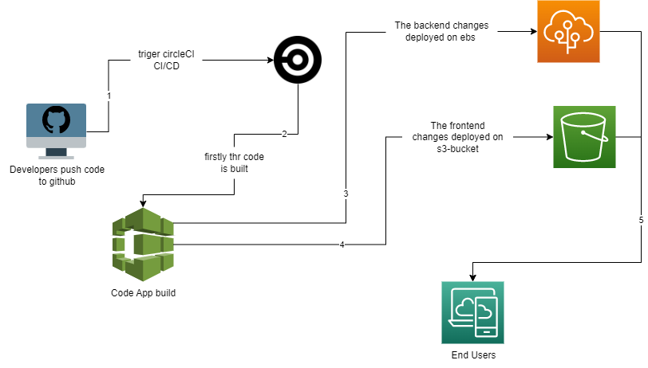

# The Pipeline Process

The developer is pushing codes to github and as circleCi accout is already connected with github repo so any change get out to the world through automated steps run with every new change of the github repo:
- Firstly the code is built.
- Then deploy changes takeplace 
    - The frontend changes deployed on S3 bucket
    - The backend changes deployed on elastic beanstalk.
- Finally the changes get published out to the end user automatically and successfully just by normal code commits pushed to github.

