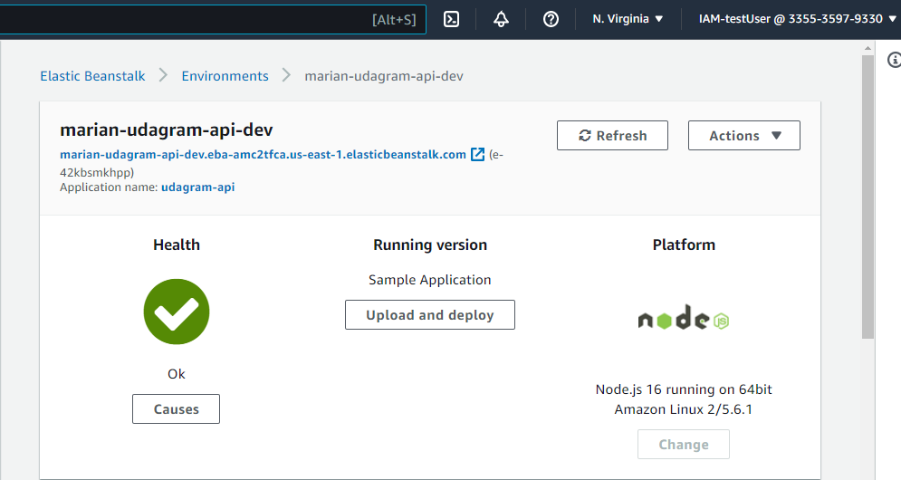
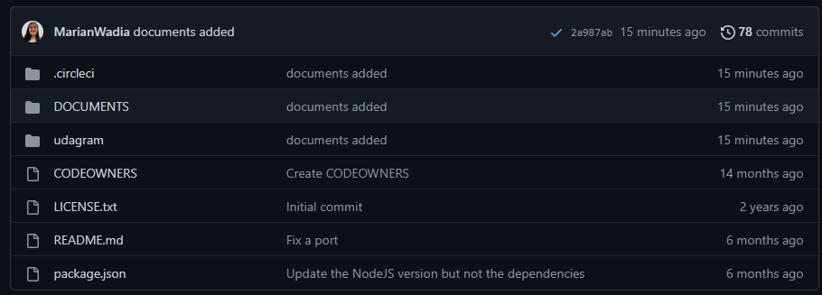

## Hosting FullStack Application 

#### RDS:

#### Elastic Beanstalk:

- Backend-API Link of Elastic beanstalk [here](http://marian-udagram-api-dev.eba-amc2tfca.us-east-1.elasticbeanstalk.com/)

#### S3 Bucket:

- Frontend Link of S3 Bucket [here](http://marian-udagramapp1478.s3-website-us-east-1.amazonaws.com)

#### CircleCi:
- Last Commit CircleCi Sucess 

- CircleCi Enviroment Variables 

#### Status of master branch:
